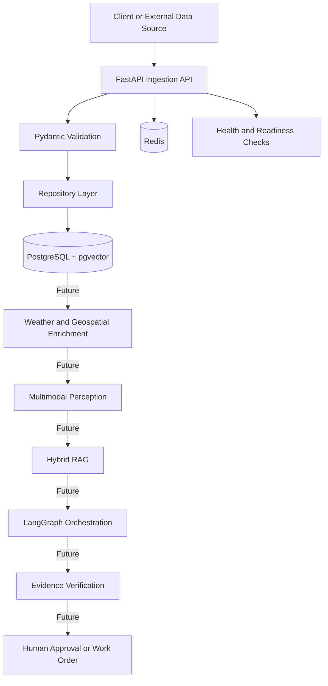

# CivicOps Sentinel

A production-oriented AI engineering platform for turning urban infrastructure reports into structured, evidence-backed incident assessments.


## Overview

CivicOps Sentinel is a multimodal AI engineering project designed to help cities and field-service teams process reports involving potholes, flooding, fallen trees, damaged signs, blocked sidewalks, storm debris, and other public infrastructure problems.

The long-term system will accept text, images, audio, video, and GPS coordinates; enrich each incident with geospatial and weather data; retrieve relevant public-works procedures; and produce an evidence-backed recommendation with human approval for high-risk actions.

The project is being built incrementally with production-grade software engineering, evaluation, observability, and safety practices rather than as a simple LLM API wrapper.

## Current Status

### Sprint 1: Reliable Incident Ingestion — Complete

The current version includes:

- FastAPI REST API
- PostgreSQL persistence
- pgvector-enabled PostgreSQL image
- Redis
- Async SQLAlchemy
- Alembic migrations
- Typed Pydantic request and response models
- Incident creation and retrieval endpoints
- Liveness and readiness checks
- Request ID middleware
- Docker Compose development environment
- Pytest test suite
- Ruff linting
- GitHub Actions continuous integration

AI models, RAG, LangGraph orchestration, and evaluation infrastructure are planned for later sprints and are not yet represented as completed features.

## Why This Project

Many public-service reporting systems collect incidents but still depend heavily on manual review, routing, prioritization, and policy lookup.

CivicOps Sentinel explores how multimodal AI can assist those workflows while maintaining:

- Evidence traceability
- Structured outputs
- Deterministic controls
- Human oversight
- Measurable model quality
- Reliable production infrastructure

The project is designed to demonstrate skills in:

- Backend and distributed-systems engineering
- Multimodal model integration
- Hybrid and visual RAG
- Agentic workflow orchestration
- Structured tool use
- LLM and retrieval evaluation
- LLMOps and observability
- Geospatial data engineering
- Reliability and human-in-the-loop design

## Architecture



### Current Request Flow

```text
HTTP request
    ↓
FastAPI route
    ↓
Pydantic validation
    ↓
Repository layer
    ↓
Async SQLAlchemy session
    ↓
PostgreSQL
```

## Technology Stack

| Layer | Technology |
|---|---|
| API | FastAPI |
| Validation | Pydantic |
| Persistence | PostgreSQL |
| Vector support | pgvector |
| ORM | SQLAlchemy Async |
| Migrations | Alembic |
| Cache / future task state | Redis |
| Package management | uv |
| Containers | Docker and Docker Compose |
| Testing | Pytest |
| Linting | Ruff |
| CI | GitHub Actions |

### Planned AI Stack

- Hugging Face Transformers
- Image-text-to-text models
- Zero-shot object detection
- Image segmentation
- Audio transcription
- LangGraph
- PostgreSQL full-text search
- pgvector dense retrieval
- Hybrid retrieval and reranking
- OpenTelemetry
- MLflow or LangSmith
- Prometheus and Grafana

## Project Structure

```text
civicops-sentinel/
├── .github/
│   └── workflows/          # CI pipeline
├── alembic/
│   └── versions/           # Database migrations
├── app/
│   ├── api/                # HTTP routes
│   ├── core/               # Configuration
│   ├── db/                 # Database sessions and base classes
│   ├── models/             # SQLAlchemy models
│   ├── repositories/       # Persistence operations
│   ├── schemas/            # Pydantic contracts
│   └── main.py             # FastAPI application
├── docs/
│   ├── decisions/          # Architecture decision records
│   ├── architecture.md
│   └── roadmap.md
├── scripts/                # Developer and seed scripts
├── tests/                  # Automated tests
├── compose.yaml
├── Dockerfile
├── Makefile
└── pyproject.toml
```

## Getting Started

### Prerequisites

Install:

- Docker Desktop
- Git
- VS Code or another code editor

No local PostgreSQL or Redis installation is required.

### 1. Clone the repository

```bash
git clone https://github.com/ShayanNazir/civicops-sentinel.git
cd civicops-sentinel
```

Replace `YOUR_GITHUB_USERNAME` with your actual GitHub username.

### 2. Create the environment file

```bash
cp .env.example .env
```

### 3. Start the application

```bash
docker compose up --build
```

The startup process will:

1. Start PostgreSQL.
2. Enable pgvector.
3. Start Redis.
4. Run Alembic migrations.
5. Start the FastAPI development server.

### 4. Open the API

- Swagger documentation: `http://localhost:8000/docs`
- Liveness: `http://localhost:8000/api/v1/health/live`
- Readiness: `http://localhost:8000/api/v1/health/ready`

## API Endpoints

| Method | Endpoint | Purpose |
|---|---|---|
| `GET` | `/` | Returns service metadata |
| `GET` | `/api/v1/health/live` | Confirms the API process is running |
| `GET` | `/api/v1/health/ready` | Confirms PostgreSQL and Redis are available |
| `POST` | `/api/v1/incidents` | Creates an incident |
| `GET` | `/api/v1/incidents` | Lists incidents |
| `GET` | `/api/v1/incidents/{incident_id}` | Retrieves one incident |

## Example Incident

### Request

```bash
curl -X POST http://localhost:8000/api/v1/incidents \
  -H "Content-Type: application/json" \
  -d '{
    "source": "manual",
    "external_id": "example-incident-001",
    "description": "A large fallen tree is blocking one traffic lane after a severe storm.",
    "latitude": 40.7128,
    "longitude": -74.0060,
    "media_urls": [],
    "context_data": {
      "reported_by": "demo",
      "city": "New York"
    }
  }'
```

### Example Response

```json
{
  "source": "manual",
  "external_id": "example-incident-001",
  "description": "A large fallen tree is blocking one traffic lane after a severe storm.",
  "latitude": "40.712800",
  "longitude": "-74.006000",
  "media_urls": [],
  "context_data": {
    "reported_by": "demo",
    "city": "New York"
  },
  "id": "generated-uuid",
  "status": "received",
  "priority": "untriaged",
  "created_at": "generated-timestamp",
  "updated_at": "generated-timestamp"
}
```

## Load Sample Data

With the stack running:

```bash
docker compose exec api uv run python scripts/seed_sample_incidents.py
```

The script creates sample reports involving:

- A pothole
- A fallen tree
- A flooded intersection

## Testing and Code Quality

Run the tests:

```bash
docker compose exec api uv run pytest
```

Run lint checks:

```bash
docker compose exec api uv run ruff check .
```

Apply automatic fixes:

```bash
docker compose exec api uv run ruff check . --fix
```

Format the code:

```bash
docker compose exec api uv run ruff format .
```

Equivalent Make targets are available:

```bash
make test
make lint
make format
```

## Database Inspection

Open a PostgreSQL shell:

```bash
docker compose exec db psql -U civicops -d civicops
```

List incidents:

```sql
SELECT
    id,
    external_id,
    description,
    status,
    priority,
    created_at
FROM incidents
ORDER BY created_at DESC;
```

Confirm pgvector is enabled:

```sql
SELECT extversion
FROM pg_extension
WHERE extname = 'vector';
```

## Engineering Decisions

### Docker-first development

Docker Compose is the default development environment so contributors can reproduce the API, PostgreSQL, pgvector, and Redis setup with one command.

See [`docs/decisions/ADR-001-docker-first-development.md`](docs/decisions/ADR-001-docker-first-development.md).

### Deterministic software before agents

The project intentionally establishes reliable APIs, storage, validation, and tests before adding LLMs.

Future agents will be reserved for ambiguous reasoning tasks. Database operations, authorization, thresholds, and external actions will remain deterministic.

### Typed system boundaries

Pydantic models define API contracts, SQLAlchemy models define storage, and repositories isolate persistence logic. This prevents model-serving and orchestration logic from becoming tightly coupled to HTTP routes.

## Development Roadmap

### Sprint 1 — Reliable ingestion foundation ✅

- FastAPI
- PostgreSQL and pgvector
- Redis
- Alembic migrations
- Typed incident endpoints
- Health checks
- Tests and CI

### Sprint 2 — NYC 311 data ingestion

- Socrata API client
- Pagination
- Retry and timeout handling
- Idempotent upserts
- Incremental synchronization
- Raw-data preservation
- Data-quality validation

### Sprint 3 — Geospatial and weather enrichment

- National Weather Service integration
- OpenStreetMap and Overpass integration
- PostGIS spatial queries
- Nearby critical-asset detection
- Spatiotemporal duplicate detection

### Sprint 4 — Hybrid and visual RAG

- Public-works PDF ingestion
- Text and page-image indexing
- PostgreSQL full-text search
- pgvector dense retrieval
- Reciprocal-rank fusion
- Reranking
- Citation and provenance objects
- Retrieval benchmark

### Sprint 5 — Multimodal perception

- Image-text-to-text analysis
- Zero-shot object detection
- Image segmentation
- Audio transcription
- Structured visual observations
- Model comparison and calibration

### Sprint 6 — LangGraph orchestration

- Typed graph state
- Deterministic tool nodes
- Planning and verification nodes
- Durable checkpoints
- Human approval interrupts
- Failure recovery

### Sprint 7 — Evaluation and LLMOps

- Golden evaluation dataset
- Retrieval metrics
- Citation and groundedness metrics
- Tool-selection accuracy
- Prompt-injection testing
- Cost and latency tracking
- CI regression gates
- Trace replay

### Sprint 8 — Scaling and deployment

- Background task queue
- Worker autoscaling
- Object storage
- OpenTelemetry
- Grafana dashboards
- Load testing
- Cloud deployment
- Threat model
- Engineering case study
- Demo video

The detailed checklist is available in [`docs/roadmap.md`](docs/roadmap.md).

## Planned Evaluation Metrics

| Area | Metrics |
|---|---|
| Perception | Precision, recall, F1, mAP, IoU, calibration |
| Retrieval | Recall@K, MRR, nDCG, citation coverage |
| Generation | Unsupported-claim rate, groundedness, completeness |
| Agents | Tool accuracy, workflow success, escalation accuracy |
| Operations | p50/p95 latency, throughput, cost per incident |
| Safety | Prompt-injection resistance, authorization failures |

Evaluation results will be versioned and used as CI quality gates rather than reported only through anecdotal demos.

## Reliability and Safety Goals

Future releases will include:

- Idempotency keys
- Input validation
- Retry policies and timeouts
- Circuit breakers
- Dead-letter queues
- Rate limiting
- Role-based authorization
- Prompt-injection defenses
- Human approval for high-risk actions
- Audit logs
- Data lineage
- Graceful degradation
- Model and tool fallback policies

## Limitations

The current release is an ingestion foundation, not a deployed municipal decision system.

It does not yet:

- Analyze images, audio, or video
- Assign incident severity automatically
- Retrieve public-works procedures
- Route incidents to agencies
- Create work orders
- Invoke LLM agents
- Replace professional or emergency judgment

These capabilities will be added only after the necessary datasets, evaluation benchmarks, and safety controls exist.

## Portfolio Value

CivicOps Sentinel is designed to demonstrate the skills expected in applied AI and AI platform engineering roles:

- Building production APIs around AI systems
- Integrating structured, unstructured, multimodal, and geospatial data
- Designing reliable tool-using workflows
- Evaluating model and retrieval quality
- Operating AI services with measurable cost, latency, and failure modes
- Separating probabilistic model behavior from deterministic application controls

## Author

**Shayan Nazir**  
Data Science student at the University of Florida

---

Built as a production-focused AI engineering portfolio project.
